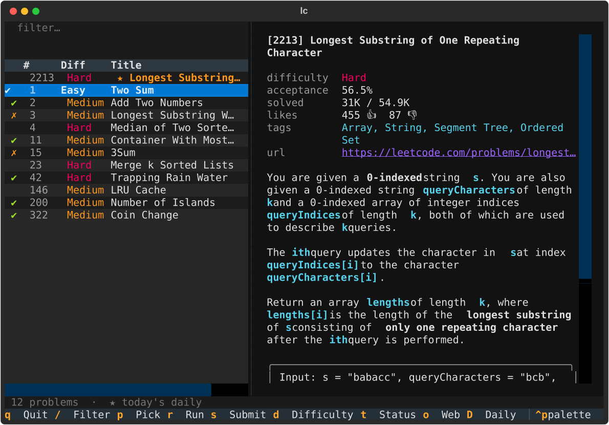
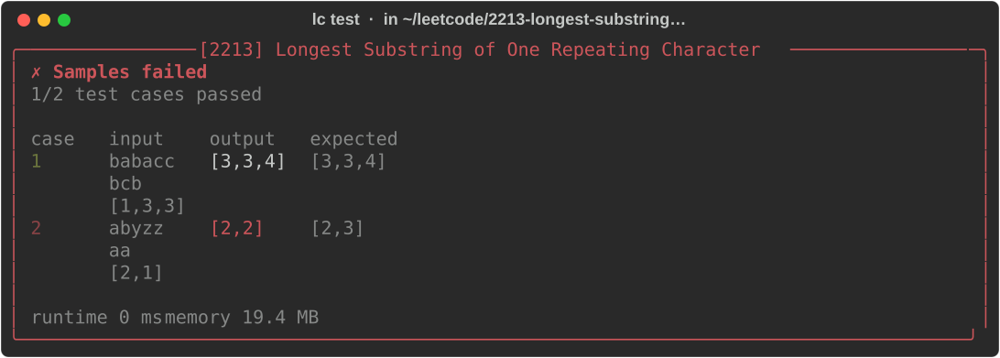
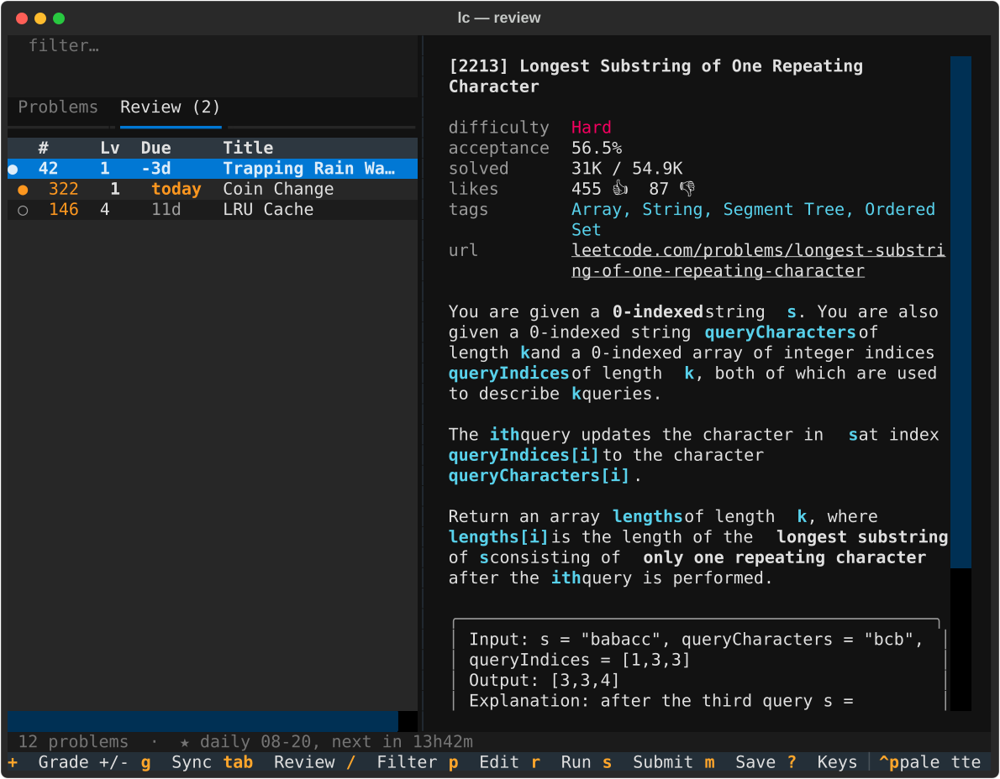
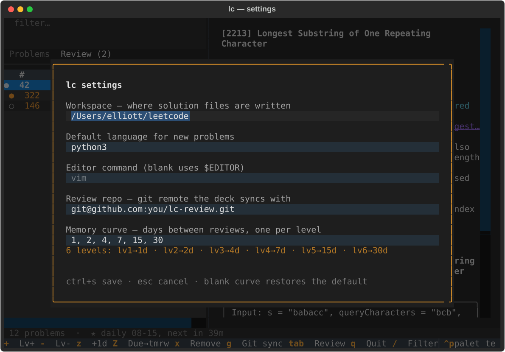
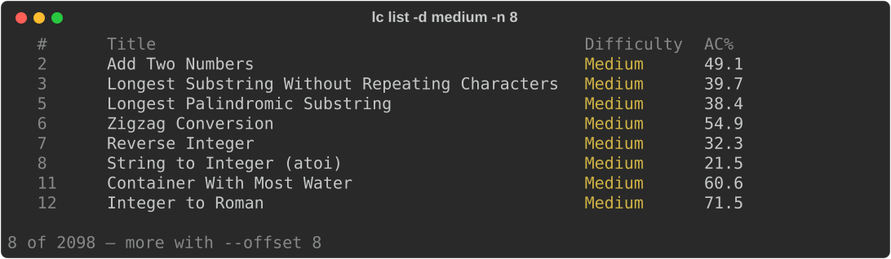

# lc — 终端里的 LeetCode

[English](README.md) · **简体中文**

浏览题目、阅读题面、用自己的编辑器写题，然后直接提交到 LeetCode 的真实判题机——全程不离开
shell。值得再看一遍的题可以放进间隔重复刷题本，它会记住你今天重做过哪些题，并跟着你在几台机器之间走。

```bash
lc                              # 全屏浏览器：选题、编辑、测试、提交
lc pick 322 --lang python3      # 生成 ~/leetcode/0322-coin-change/solution.py 并打开
lc test                         # 在 LeetCode 判题机上跑样例
lc submit                       # 正式提交
```





**目录** · [安装](#安装) · [登录](#登录) · [浏览器界面](#浏览器界面)
· [刷题本](#刷题本) · [跨机器同步](#跨机器同步) · [Vim](#vim)
· [设置](#设置) · [全部命令](#全部命令) · [文件都放在哪](#文件都放在哪) · [WSL](#wsl)

## 安装

```bash
brew install elliott-byte/tap/lc-cli
# 或者用 uv：
uv tool install git+https://github.com/Elliott-byte/lc-cli
```

从本仓库的 checkout 安装用 `uv tool install .`——改动源码后重新执行一次。想参与开发就用本地
venv：

```bash
uv venv && uv pip install -e '.[dev]' && .venv/bin/python -m pytest
```

## 登录

`lc` 以你的身份访问 leetcode.com，用的是浏览器里的会话 cookie。

```bash
lc login
```

会直接从本机浏览器（Chrome、Firefox、Safari、Edge 等）读取并验证。还没登录？它会打开
LeetCode 登录页——在那里登录，回车，`lc` 就能拿到新 cookie。macOS 上系统可能会弹一次钥匙串
授权；读取 Safari 的 cookie 需要给终端 App 完全磁盘访问权限。

如果没有任何浏览器存储可读（远程机器、小众浏览器）：

```bash
lc login --paste                 # 从 DevTools → Application → Cookies
                                 # 复制 LEETCODE_SESSION 和 csrftoken
lc login --session … --csrf …    # 脚本化
```

Cookie 以 `0600` 权限写入 `~/.lc/cookies.json`；不想落盘也可以通过 `$LEETCODE_SESSION` /
`$LEETCODE_CSRF` 提供。会话每隔几周过期——重新 `lc login` 一次即可。

## 浏览器界面

直接敲 `lc`（或 `lc tui`）打开双栏：左边题目列表，右边题面。新机器上它会自己下载题目索引。

节奏是：移到一道题，`enter` 在编辑器里打开，写完退出编辑器回到列表，`r` 跑样例，`s`
提交——循环往复。对已经开始的题按 `enter` 会重新打开你已有的文件。

今天的每日一题用黄色 `★` 置顶，打开应用时默认选中，永远只差一次按键；任何时候按 `D` 都能跳回去。
状态栏会写明它属于哪一天、下一道还有多久——`★ daily 08-15, next in 43m`。LeetCode 在
**UTC 午夜**换题，所以在东半球，本地日期会比屏幕上的每日一题早一天，早上有一段时间看着
像是“没刷新”。

✔/✗ 标记会自己保持新鲜：从编辑器回来时会重读本地索引，在 Vim 里 `\s` 提交的结果立刻可见；
`ctrl+r` 随时手动刷新——本地即时，不同于会重新下载整个索引的 `R`。会话过期时刷新
不会清掉已有的 ✔/✗ 标记——登出不等于没做过。

| 按键 | 作用 |
| --- | --- |
| `↑` `↓` | 在列表中移动 |
| `/` | 过滤（`esc` 或 `enter` 回到列表） |
| `enter` / `p` | 生成解题文件并打开编辑器 |
| `r` | 跑样例 |
| `s` | 提交 |
| `tab` | 在 **Problems** 和 **Review** 两个标签页之间切换 |
| `m` | 把当前题存进刷题本 |
| `c` | 设置 |
| `d` / `t` | 切换难度 / 状态过滤 |
| `o` | 在 leetcode.com 打开该题 |
| `D` | 跳到今天的每日一题 |
| `?` | 列出全部快捷键（含底栏没显示的） |
| `q` | 退出 |

中间那条竖线可以拖动，把宽度分给任意一边；拖到某一边只剩 24 列时会停住。

打开一道题只是把计时器**备好**，在 Vim 里**按 `space` 才正式开始**——没按之前状态栏会一直提示。
时钟只在做题的地方——**Vim 的状态栏**，TUI 里不显示。按 `\z`
暂停——弹出遮罩把代码和题面一起盖住，停着表还能读题就等于白嫖时间；在遮罩里按 `space` 继续。
提交失败计时照走；提交**通过**时计时停止并报告用时——TUI 的 `s`、命令行的 `lc submit`、Vim 里的
`\s` 都算。`\Z` 把计时归零重来一局。`lc timer` 可以在 shell 里看当前时钟（还有
`start` / `pause` / `resume` / `reset`），`lc config timer off` 整个关掉。就算是直接
`vim solution.py` 打开的会话，按 `space` 也一样能起表。退出 Vim 会自动暂停计时——编辑器里的
时间才是做题时间——下次进来按 `space` 继续。就算哪次崩溃让表整夜空转，下次打开这道题时
那段幽灵时间也会被丢弃，不会计入。

点题面里的 `url` 那一行就能在浏览器里打开该题；按 `o` 效果一样，两个 tab 都能用。在 Vim 的题面
面板里同一行需要**双击**（或者用 `\o`，两个窗口都行）：那里鼠标归 Vim 管，单击根本到不了终端，
而且 Vim 的终端会把构成链接的那段转义序列吃掉。

底栏只放常用的解题循环。`c`（设置）、`d`/`t`（过滤）、`o`（在网页打开）、`D`（跳到每日一题）、
`ctrl+r`（本地刷新）、`R`（重新下载索引）都照常可用——按 `?` 看完整列表，再按 `?`、`esc` 或 `q` 收起来。

## 刷题本

有的题值得见第二次、第五次。按 `m` 把它放进 **Review** 标签页，它会沿艾宾浩斯记忆曲线升级：
1 天后再见，然后 2、4、7、15 天，一路延伸到 10 级的一年。到期的题排在最上面，标签页还会直接
写出数量：`Review (3)`；底部状态栏则统计整个刷题本——`69 on the deck · 3 due`——输入 `/` 过滤时跟着收窄。



**你来打分，lc 负责记住。** 把到期的题重做一遍然后提交：lc 会把那一行标出来——通过是绿底
加 `✔`，没通过是红底加 `✗`——但**不动等级**。你按 `+` 升一级（或 `-` 降级），标记随即清除。
等级始终由你决定：蒙对的、或者偷看过答案的题，不该自己悄悄换来一个月的间隔。提交完切到
Review 页，光标已经停在你刚做的那道题上，`+` 或 `-` 不会打错行。

完全没想起来的题按 `0`，直接打回 1 级，明天再见。忘掉一道题降一级是不够的——9 级的题降到
8 级，照样能给自己换来三个月。

**也可以交给判题机打分。** 如果你更愿意让评测结果说了算：

```bash
lc config autograde on
```

此后提交一道刷题本里的题就会自己动等级——通过升一级，没过降一级，并从今天起重新排期。
一天只认第一次打分：反复提交通过的代码不会把等级一路顶到 10 级，手动按下的 `+` / `-` / `0`
不会被之后的提交推翻，刚加入刷题本那天也保持 1 级不动。默认关闭：判题机只知道代码过没过，
不知道你到底记没记住。

在哪提交都算——TUI 里、shell 里的 `lc submit`、Vim 里的 `\s`——所以你在 Vim 里做完的题，
回到列表时已经是绿的了。标记只描述“今天”：打完分就消失，没打分的话隔夜也会自动褪去——跨天时 TUI 自己翻页，
到期数量和每日一题也跟着更新，一个键都不用按。

不会有任何东西被偷偷加进来。只有 `m`、Vim 的 `\m` 和 `lc review add` 会往刷题本里加题。

Review 页的按键：

| 按键 | 作用 |
| --- | --- |
| `+` `=` / `-` `_` | 手动调级（从今天起重新排期） |
| `0` | 完全不记得了——直接打回 1 级 |
| `z` | 把这道题推到明天 |
| `Z` | 推掉今天所有到期的题——“今天不想刷”按钮 |
| `x` | 移出刷题本 |
| `g` | 和你的 git 仓库同步 |
| `enter` | 照常在编辑器里打开 |

同一个刷题本在 shell 里：

```bash
lc review                  # 整个刷题本，最先到期的在前
lc review add 322 -l 3     # 手动保存，从 3 级起步
lc review add              # ……或者就存你正待着的这个题目目录
lc review level 322 5      # 手动设定等级
lc review postpone         # 到期的全推到明天
lc review rm 322
```

曲线随你定——每级一个间隔（单位天），条目数就是级数：

```bash
lc config curve 1,2,4,7,15,30    # 六级
lc config curve reset            # 回到默认的艾宾浩斯曲线
```

## 跨机器同步

指一个你自己的 git 仓库给 lc，刷题本就跟着你走——笔记本和 WSL 机器保持一致。

```bash
lc config repo https://github.com/you/lc-review.git
lc review sync             # 拉取、合并、推送（或在 Review 页按 g）
lc review pull             # 只把仓库里的刷题本拉下来
lc review push             # 只把本机的刷题本推上去
```

除非你有 GitHub 认可的 SSH key，否则用 `https://` 开头的地址——只要 `gh` 登录过，https
开箱即用。同步失败时会说明原因和下一步该做什么。

配好仓库后，Review 页底部会有一条状态栏：

| 显示 | 含义 |
| --- | --- |
| `✔ synced 2h ago` | 刷题本和仓库一致（截至上次同步） |
| `↑ 3 changes to push · synced 2h ago` | 之后又改过，有 3 处待推送 |
| `○ not synced yet — press g` | 配好了但还没同步过 |
| `✗ last sync failed: …` | 显示失败原因，并给出提示 |

这条状态只读本地文件算出来——刷新列表永远不会去连网络——所以 “synced” 的意思是
“上次通信时和仓库一致”，而不是“刚查过 GitHub”。没配仓库时整条不显示。

**合并是怎么做的。** lc 在 Python 里合并，不在 git 里，所以你永远不会被要求解决冲突。两边取
并集，同一道题两边都有时，**最后改动的那份**胜出：每次改动都会盖一个 UTC 时间戳，所以两台机器
在同一天操作也能正确定序。删除同样会传播——移除一道题会留下一个墓碑，墓碑也是一次改动，于是
另一台机器跟着删掉，而不是把题还回来。被删掉的题重新加入会从 1 级复活。两台机器同时推送时，
lc 会自己重做一次同步，你不会看见。

lc 在 `~/.lc/review-repo` 保留一个私有克隆，往仓库里写两个文件：`review.json`（它读回来的
刷题本）和 `REVIEW.md`（同一份数据的带链接表格，GitHub 上直接可读）。它**不会**写
`README.md`，所以指向一个已有 README 的仓库也是安全的。

一个刷题本只属于一个人，所以提交的作者就是**你自己的 git 身份**——和你平时写代码用的
`user.name` / `user.email` 同一个，不需要另外配置。lc 只读它，不会改它。万一某台机器
git 完全没配身份，才会退回 `lc <lc@localhost>`，免得直接提交失败。

只有当你希望这些提交算到别的邮箱名下时，才需要覆盖：

```bash
lc config author you@example.com     # --name 设定提交者名字
lc config author none                # 回到你的 git 身份
```

`lc config show` 会写明它将以谁的身份提交，以及这个身份是哪来的。

## Vim

```bash
lc setup vim
```

往 `~/.vim/plugin/lc.vim` 放一个小插件——不改 `.vimrc`，删掉文件即卸载。如果还没配置过编辑器，
它还会顺手执行 `lc config editor vim`，让 `lc pick` 直接进入 Vim。

在解题 buffer（`.lc.json` 旁边的任何文件）里，普通模式：

| 按键 | 作用 |
| --- | --- |
| `\t` | 保存，然后 `lc test` |
| `\s` | 保存，然后 `lc submit` |
| `\p` | 在左侧分屏显示/隐藏题面 |
| `\o` | 在浏览器打开题目页（图片动画在那边看） |
| `\m` | 把这道题存进刷题本 |
| `space` | 正式开始计时（开始之后 space 恢复原本作用） |
| `\z` | 暂停做题计时，弹出遮罩（在遮罩里按 space 继续） |
| `\Z` | 计时归零重来（会先确认） |
| `\q` | 全部保存并退出——回到 TUI/shell |

打开解题文件时题面会自动出现在旁边——`\p`（或在面板里按 `q`）隐藏，`\p` 再唤回，也可以用
`let g:lc_auto_statement = 0` 改成手动。在**哪个窗口**按 `:q` 都是“我走了”——题面是附属面板，不是需要单独关一次的第二个文档；
`:qa`、`:x`、`ZZ`、`\q` 同理。有未保存的改动时照样会像原生 Vim 一样拦住你。

只要你的 Vim 带 `+terminal`（或用 Neovim），这个面板显示的就是完整渲染的题面——一个小终端
分屏里跑 `lc show`，颜色和示例框和 CLI 里一模一样。不支持时回退到目录里的原始 `README.md`；
`let g:lc_statement_render = 0` 可强制所有情况都用纯文件。

Python buffer 会保持空格缩进：Tab 键输出空格，粘贴进来的真 Tab 在保存时转换。LeetCode 的
起始代码用空格，判题机对一个混入的 Tab 直接报 `TabError`——`let g:lc_python_indent = 0`
可以关闭。

快捷键和计时都显示在**代码窗口**的状态栏上（窗口窄时自动省略次要的）；题面窗口的状态栏只写
`q close`，免得同一行里两份时钟两份按键——但所有键在两个窗口里都照常能用（`let g:lc_statusline = 0`
可以不动你自己的状态栏）。打开时光标默认在**代码那一侧**，而且题面面板是只读的——它是拿来读的，
不是拿来打字的；`ctrl+w h` 过去看，`ctrl+w l` 回来。题面面板里也绑了同样的快捷键，所以光标在
哪个窗口都无所谓——`\t` 一样会保存解题文件、在题目目录里执行；在哪里启动的 Vim 也无所谓。`<leader>` 默认是反斜杠。升级 `lc`
之后重新跑一次 `lc setup vim --force`；Neovim 用户把同一个文件复制到 `~/.config/nvim/plugin/`。

## 设置

在 TUI 里按 `c` 打开设置页：工作区、默认语言、编辑器、刷题本仓库、记忆曲线（边打字边预览这条
曲线的含义），以及自动评级和做题计时两个开关。`ctrl+s` 保存，`esc` 取消。



同样的设置在 shell 里：

```bash
lc config show
lc config lang go                  # `lc pick` 的默认语言
lc config workspace ~/code/leetcode
lc config editor "code -w"         # 不设则用 $EDITOR / $VISUAL
lc config curve 1,2,4,7,15,30      # 每个复习等级的间隔天数
lc config repo https://github.com/you/lc-review.git
lc config author you@example.com   # 刷题本提交的作者身份
lc config autograde on             # 让提交结果自己调等级
```

## 全部命令



| 命令 | 作用 |
| --- | --- |
| `lc list [关键词]` | 浏览题库。`-d easy`、`-t "Two Pointers"`、`-s todo`、`--free` |
| `lc show 322` | 打印题面，按终端排版 |
| `lc pick 322 -l go` | 从起始代码生成解题文件并打开 `$EDITOR` |
| `lc edit 322` | 重新打开已有的解题文件 |
| `lc test` | 在 LeetCode 判题机上跑样例 |
| `lc submit` | 提交；打印判定、运行时间和击败百分比 |
| `lc daily` | 今天的每日一题（`--pick` 直接开做） |
| `lc random -d medium` | 随机抽一道没做过的题 |
| `lc review` | 刷题本（`add` / `rm` / `level` / `postpone`） |
| `lc review sync` | 和你的 git 仓库同步刷题本（也有 `pull` / `push`） |
| `lc stat` | 按难度统计你的解题数 |
| `lc history 322` | 某题的最近提交记录 |
| `lc code` | 高亮打印当前解答 |
| `lc tags` | 话题标签，按题目数排序 |
| `lc sync` | 刷新本地题目索引 |
| `lc setup vim` | 安装 Vim 快捷键 |
| `lc tui` | 全屏浏览器（直接敲 `lc` 也一样） |

`lc test`、`lc submit`、`lc code`、`lc edit`、`lc history` 和 `lc review add` 在题目目录里
运行时不用带参数——它们会从 `.lc.json` 里读。

`lc test` 和 `lc submit` 判定失败时以非零退出，所以可以直接组合：

```bash
lc test && lc submit -y
```

## 文件都放在哪

解题文件放在一个普通的、你看得见的工作区里，方便自己用 git 管理：

```
~/leetcode/
  0322-coin-change/
    README.md      题面（Markdown）
    solution.py    起始代码 + 你的解答
    .lc.json       这个目录对应哪道题、什么语言
```

整个解题文件都会被提交；lc 写入的文件头是目标语言的注释，判题机会忽略它。

lc 自己的东西都在 `~/.lc` 下（设 `$LC_HOME` 可整体挪走）：

| 文件 | 是什么 |
| --- | --- |
| `config.json` | 你的设置 |
| `review.json` | 刷题本——**用户数据**，不会被重建 |
| `cookies.json` | 会话 cookie，权限 `0600` |
| `cache.db` | 题目索引和题面缓存——随时可删，lc 会重建 |
| `review-repo/` | 同步用的私有克隆 |

## WSL

以上一切在发行版内原样可用——用同一条 `uv tool install` 安装，TUI、判题和 vim 插件的行为与任何
Linux 相同。跨越 Windows 边界的部分都处理好了：网页通过 Windows 侧浏览器打开（`explorer.exe`，
装了 wslu 则用 `wslview`）；`lc login` 直接穿过 `/mnt/c` 读取 Windows Firefox 的配置文件，
Firefox 用户自动登录。Windows 的 Chrome 和 Edge 用只有浏览器自己能解开的密钥加密 cookie
存储——在那里用 `lc login --paste` 登录；登录流程也会提示你。

## 备注

- Accepted 有烟花——`lc test` 一组小的，`lc submit` 四连发大的；失败则是一个小人缓缓跪地
  （orz），提交失败时头顶还会飘来一朵乌云下雨。管道和脚本里自动跳过，`LC_NO_FX=1` 全局关闭。
- 付费题需要会员账号；lc 会明确说明，而不是奇怪地失败。
- `lc test` 和 `lc submit` 跑在 LeetCode 的判题机上而非本地，判定和运行时间百分比都是真实数据。
- 请求以人类节奏发往 leetcode.com。脚本批量循环会触发限流；lc 会把它作为明确的错误报出来。
